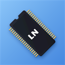
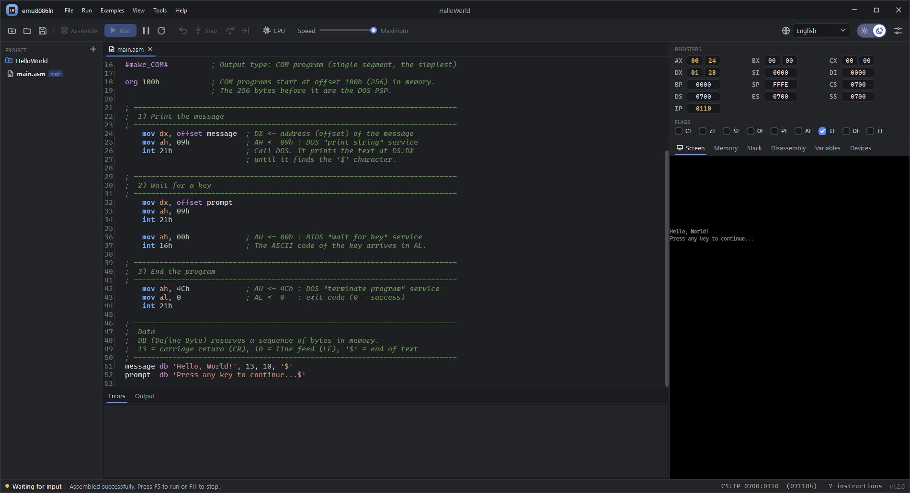
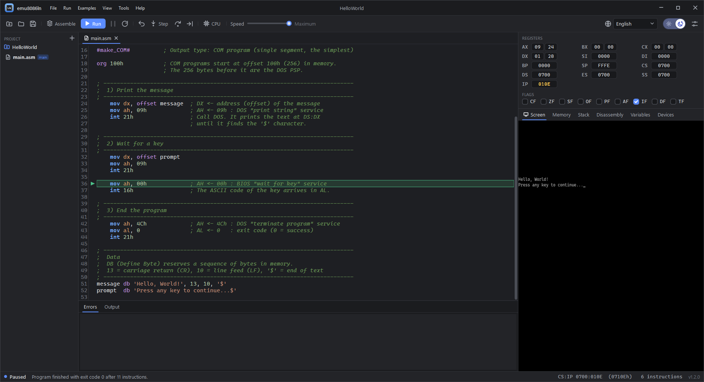
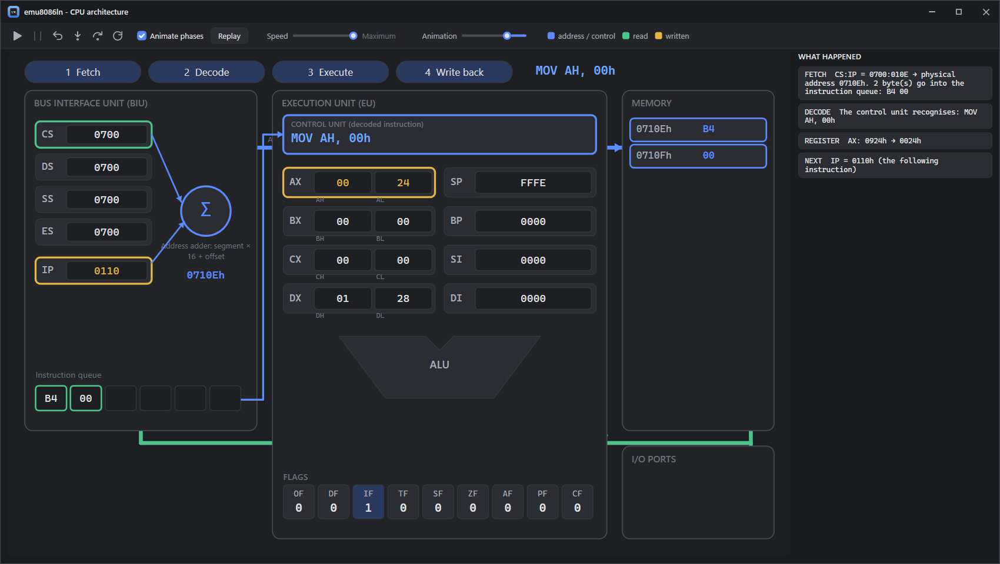
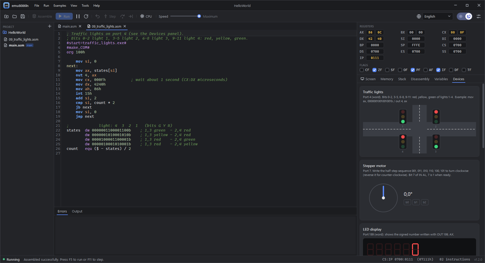

# emu8086ln

<p align="center"></p>

A modern **8086 microprocessor emulator, assembler and learning environment** for Windows 11.
Source-compatible with emu8086 programs (`#make_COM#`, `emu8086.inc`, virtual devices).

## Screenshots






## Features

- **Assembler** – MASM / emu8086 syntax, multi-pass; COM, EXE (MZ), BIN and BOOT output.
  Macros (`MACRO`, `LOCAL`, `REPT`), `INCLUDE`, `SEGMENT`, `.MODEL/.DATA/.CODE`, `PROC`, `EQU`, `DUP`,
  conditional assembly. Out-of-range conditional jumps are expanded automatically.
- **CPU** – the complete 8086 instruction set (plus the 80186 additions emu8086 accepts) with exact flag behaviour.
- **BIOS / DOS** – INT 10h (80x25 text and 320x200x256 graphics), 16h, 15h, 1Ah, 17h, 33h (mouse) and 21h
  (console, buffered input, files, date/time...). Files live on a sandboxed virtual drive `C:`.
- **Debugger** – step (F11), step over (F10), **step back** (Shift+F11), run to cursor, breakpoints (F9),
  speed control; registers, flags, memory (hex), stack, disassembly and variables.
- **CPU architecture visualizer (F12)** – replays every instruction inside the BIU / EU
  (fetch, decode, execute, write back), showing address calculation, ALU work and data flow with explanations.
- **Virtual devices** – traffic lights, stepper motor, LED display, thermometer/heater, robot, printer, port monitor.
- **IDE** – projects and templates, tabs, syntax highlighting, auto-completion with help balloons,
  find / replace (Ctrl+F, Ctrl+H), go to line (Ctrl+G), instruction reference, 28 example programs,
  light/dark theme, English / Türkçe / Deutsch UI, adjustable fonts and sizes.
- **Files and tools** – listing (.lst) and symbol table export, open and step through `.com` / `.exe` / `.bin`
  files without source, emu8086 `#AX=...#` register presets, number converter / calculator, ASCII table.
- **Hardware extras** – virtual 1.44 MB floppy with INT 13h (write a program to it and boot from it),
  optional `emu8086.io` shared port file so external programs can act as devices.
- **Auto save** – off, every N seconds, or smart (waits for a pause in typing, saves bigger edits and line changes at once, small edits after N seconds, everything when you leave the file).
- **Code analysis** – warns while you type about unreachable code, procedures with unbalanced PUSH/POP and jumps to raw numbers (can be turned off in Settings).
- **Instruction timeline** – the CPU visualizer lists recent instructions with the units they used; click one to replay it or rewind to it (can be turned off in Settings).
- **Report export** – save the screen, registers, flags, output and source as a single HTML file, handy for homework.
- **Updates** – shows the version, checks GitHub Releases on request (or at startup if enabled) and installs updates.

## Download

Get the latest `emu8086ln-*-win-x64.zip` from [Releases](../../releases), extract it and run `emu8086ln.exe`.
No installation or .NET runtime is required.

## Build from source

Requires the .NET 10 SDK.

```bash
dotnet run --project src/Emu8086.App
dotnet test
```

Self-contained release build:

```bash
dotnet publish src/Emu8086.App -c Release -r win-x64 --self-contained true -p:PublishSingleFile=true -p:IncludeNativeLibrariesForSelfExtract=true -p:EnableCompressionInSingleFile=true -p:DebugType=None -o publish/emu8086ln
```

## Project layout

| Folder | Contents |
|---|---|
| `src/Emu8086.Core` | CPU, assembler, disassembler, BIOS/DOS, virtual devices, step analysis |
| `src/Emu8086.App` | WPF user interface; texts in `config/lang`, templates in `config/templates`, reference in `config/reference` |
| `tests/Emu8086.Tests` | Encoding, CPU, execution, sample program and analysis tests |
| `tools/make_logo.py` | Generates the application icon |

User data: projects and the virtual drive in `Documents\emu8086ln`, settings in `%APPDATA%\emu8086ln`.

Adding a UI language is a matter of copying `config/lang/en.json` to a new file and translating the values.

## License

[MIT](LICENSE). emu8086ln is an independent project and is not affiliated with emu8086.
